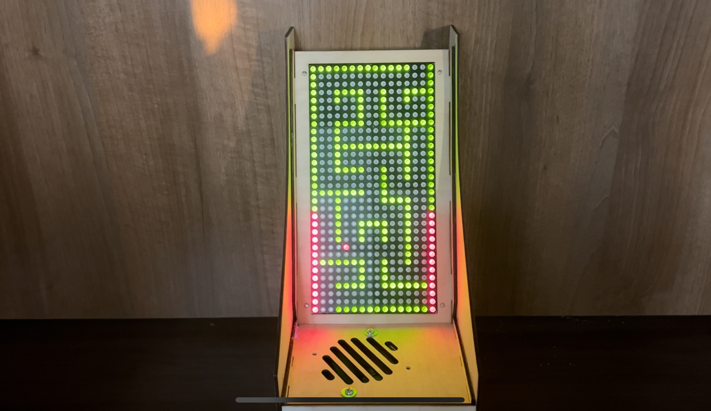
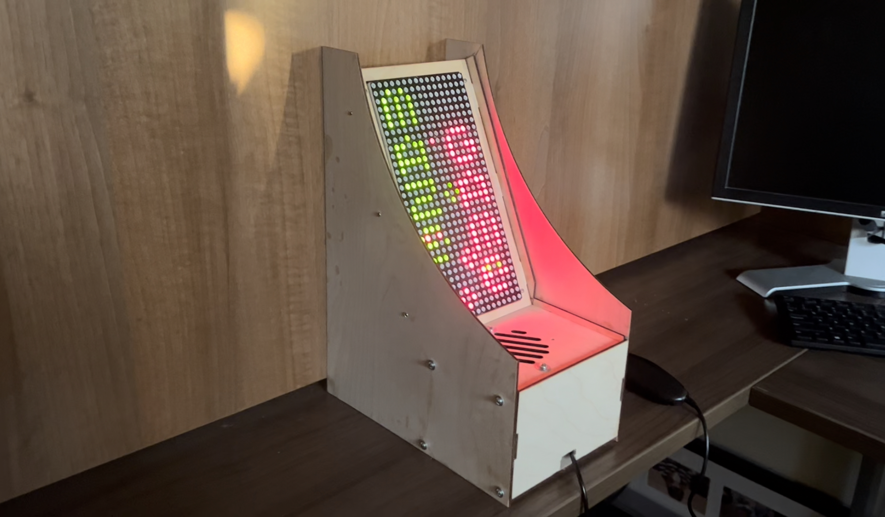
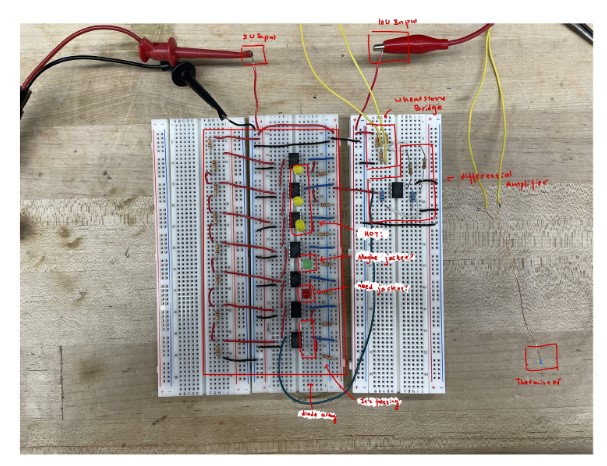
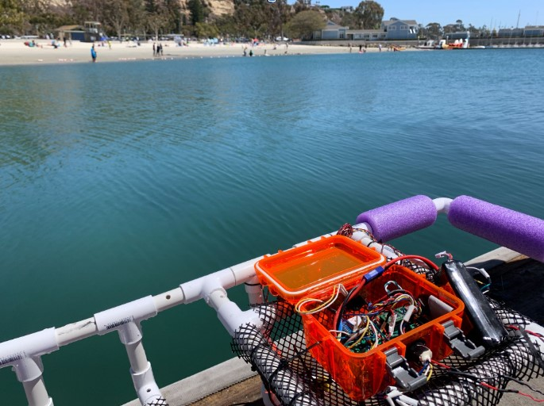
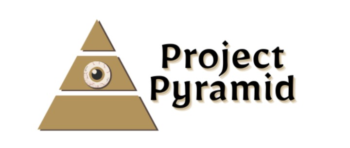
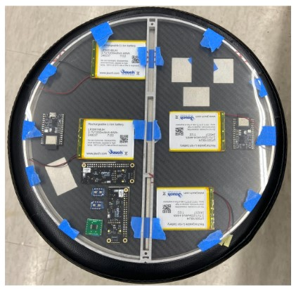
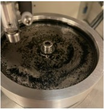
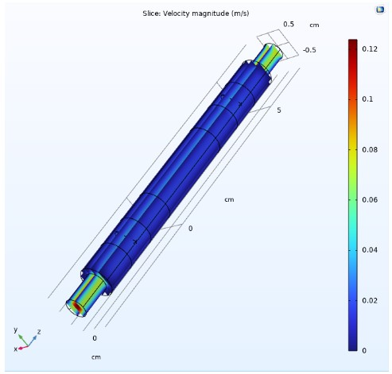

This is the portfolio page for Cecilia Li, a 22 year old general engineering major graduated from Harvey Mudd College. Below shows the projects I have worked on. You can click on each of the project categories to see the details and documentations.
Here is my [LinkedIn](https://www.linkedin.com/in/cecilia-huijie-li-722222243/).

# Team and Individual Projects 
Below are some of my team and individual projects. [(details)](https://celi23.github.io/Portfolio/individualprojects)

#### A-Mazing Game: 

  
  

This is a project made with two other teammates in an effort to make an arcade game that is playable by a Wii Nunchuck. This is a maze game allows the user to direct a dot to the end of the maze, giving scores for the time the user takes. The team wrote the driver for the LED matrix, Wii Nunchuck, and the connection between the MCU and the FPGA.

#### Jacket Indicator:

  

Designed and created a circuit that allows the user to see if the weather needs a jacket or not. Using operational amplifiers as comparators, we successfully created a LED array that can light up according to different temperatures the temperature sensor determines.

#### Underwater Robot:

  

The team designed an underwater robot that uses sonar to detect the depth of the water below it, along with GPS and thermistors to determine its position and temperature gradient of the sea water. The team also constructed a circuit board with operational amplifiers to buffer and filter the signal sensed from the sensors to produce predicted data from real time deployment

#### AllAboutPC:

  

Designed a website called AllAboutPC that allows user login, a backend database that contains user information, and a platform that allows users to ask other users questions about PC. Used and learned different web building techniques including React, HTML, and CSS.

# Clinic Projects 
These projects are clinic projects done in collaboration with cooporate companies. [(details)](https://celi23.github.io/Portfolio/clinicprojects)

#### Project Pyramid:

  

This project focuses on the automation of the production of the products. The team explored new and existing ideas of automation and aimed to produce an automated manufacturing system. The team also helped using alternative solutions to reduce water on the production line. I focused on producing new ideas on automation, and construction low resolution prototypes for automation systems. I worked on designing and constructing a fluidized bed for the production line.

#### Ultra-High Vacuum Inspection Wafer:

  
  <!--  -->

Lead and managed the team with logistics such as budgeting, team dynamic, and work progression in the latter half of the project. Utilized Bluetooth Low Energy nimble server and client protocol to send data in short distances. Engaged in full system design, connecting and integrating subsystems using microcontroller, temperature sensors, and several cameras

# Lab Research Projects 
These are projects I participated with preisting labs. [(details)](https://celi23.github.io/Portfolio/labprojects)

#### GSG friction data analyzation:

  

Worked with a new substance called Gas Phase Synthesized Graphene using tribometer to observe its wear reducing effects along with PAO (Polyalphaolefin). Used ImageJ and Python to process and analyze images of the substance to correlate with experimental results of wear volume and frictional force.

#### Water filtration system research and design:

  

Researched the financial and technical hardships with water filtration systems in the water industry. Designed and simulated a Rapid Small Scale Column testing site with COMSOL with porous media study in a stationary and a time dependent model, created process router for this design. 

