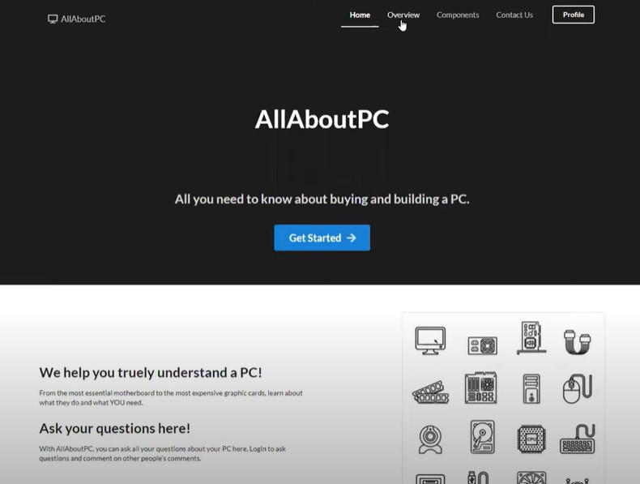

This is the portfolio page for Cecilia Li, a 22 year old general engineering major recently graduated from Harvey Mudd College. I concenterated in electronics engineering during college. In my free time, I like to climb, read, do small DIY projects, and make costumes for cartoon characters. 

Below shows the projects I have worked on. You can click on some of the project categories to see the details and documentations. Here is my [LinkedIn](https://www.linkedin.com/in/cecilia-huijie-li-722222243/).

Contact me! My email is: li.cecilia23@gmail.com. My phone number is: 9097609304.

# Team and Individual Projects
Below are some of my team and individual projects.

#### [A-Mazing Game](https://celi23.github.io/Portfolio/amazinggame):
This is a project made with two other teammates in an effort to make an arcade game that is playable by a Wii Nunchuck. This is a maze game that allows the user to direct a dot to the end of the maze, tracking scores for the time the user takes. The team wrote the driver for the LED matrix, Wii Nunchuck, and the connection between the MCU and the FPGA.

  
  

The game is mounted onto a arcade machine wodden model, where the user can use the nunchuck to play comfortablly, like a real arcade game! The team also created a website that contains all our documentation. [Check it out here!](https://martin5009.github.io/amazing_game)

#### [Jacket Indicator](https://celi23.github.io/Portfolio/jacketindicator):
Designed and created a circuit that allows the user to see if the weather needs a jacket or not. Using operational amplifiers as comparators, we successfully created a LED array that can light up according to different temperatures the thermistor senses.

  

As shown above, this project was done on a breadboard with enough schematic to incorporate into a protoboard.

#### [Underwater Robot](https://celi23.github.io/Portfolio/underwaterrobot):
With two other classmates, the team designed an underwater robot that uses sonar to detect the depth of the water below it. This robot also has  GPS and thermistors to determine its position and temperature gradient of the sea water. The team also constructed a circuit board with operational amplifiers to buffer and filter the signal sensed from the sensors to produce data from real time deployment.

  
  

This robot was deployed in Dana point, California and produced data from the deployment. Seen on the left, we were waiting for the GPS to lock looking at the ocean. The structure of the robot is seen on the right.

#### [AllAboutPC](https://celi23.github.io/Portfolio/allaboutpc):
Designed a website called AllAboutPC that allows user login, a backend database that contains user information. This website also provides a platform that allows users to ask other users questions about PC. Used and learned different web building techniques including React, HTML, and CSS.

  

This picture shows the main page for the website. Each tab on the page leads you to different page that contains animetion that details each component of a PC. Unfortunately this website was created on a local network and is not published on the internet. A demonstration of the website can be found [here](https://www.youtube.com/watch?v=Fm7WJDabT0c&ab_channel=CeciliaLi).

# Clinic Projects 

These projects are clinic projects done in collaboration with cooporate companies.

#### Project Pyramid:
This project focuses on the automation of the production of the products. The team explored new and existing ideas of automation and aimed to produce an automated manufacturing system. The team also helped using alternative solutions to reduce water on the production line. I focused on producing new ideas on automation, and construction low resolution prototypes for automation systems. I worked on designing and constructing a fluidized bed for the production line.

  

Above is the logo for the project. Unfortunately, because of NDA reasons, the company is undisclosed to the public.

#### Ultra-High Vacuum Inspection Wafer:
In this project, I lead and managed the team with logistics such as budgeting, team dynamic, and work progression in the latter half of the project. We utilized Bluetooth Low Energy nimble server and client protocol to send data in short distances. The team engaged in full system design, connecting and integrating subsystems using microcontroller, temperature sensors, and several cameras.

  

Working with Applied Materials, the team was able to experience industry working environment. We presented our prototype to our school and our liaisons. 

# Lab Research Projects 
These are projects I participated with preisting labs.

#### GSG friction data analyzation:
In this lab, I worked with a new substance called Gas Phase Synthesized Graphene using tribometer to observe its wear reducing effects along with PAO (Polyalphaolefin). I used ImageJ and Python to process and analyze images of the substance to correlate with experimental results of wear volume and frictional force.

  

The image above shows how the image of the GSG seperated with PAO is processed with ImageJ. It is able to count the amount of clumbs seen from the picture taken. This allows us to quantify the seperation and effetively test seperation of GSG and PAO over time. 

#### Water filtration system research and design:
In this lab, I first understood the project by researching the financial and technical hardships with water filtration systems in the water industry. With that, I designed and simulated a Rapid Small Scale Column testing site with COMSOL with porous media study in a stationary and a time dependent model, created process router for this design. 

  
  

The pictures shown above shows the COMSOL model I made with specific column diameter and speres in between to defuse the velocity flow. As shown, the velocity inside of the column is constaint.

