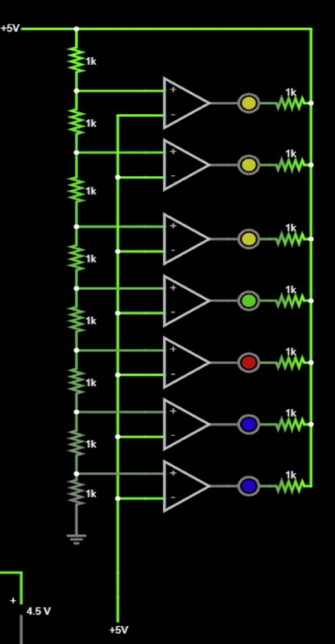
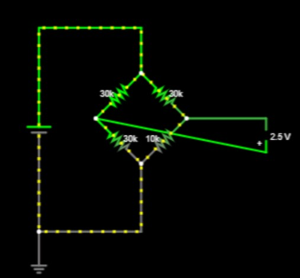
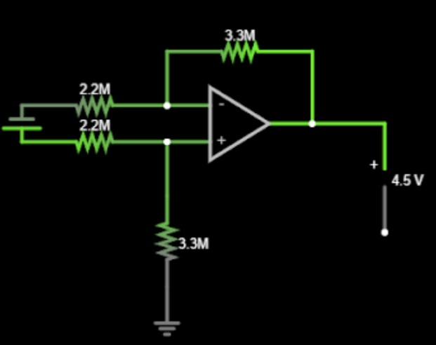
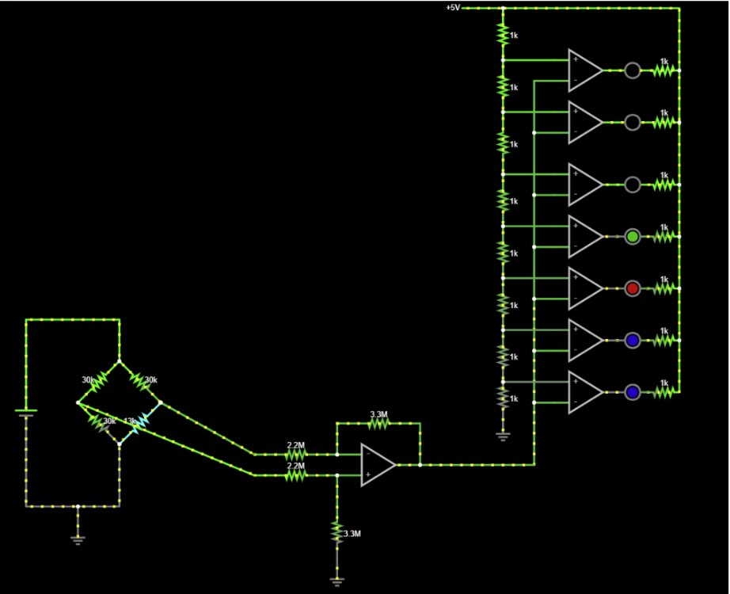

### A-Mazing Game: 
[See it in action!](https://www.youtube.com/watch?v=Vm8TDvq7yHE&ab_channel=Antrym)

[Documentations are here!](https://martin5009.github.io/amazing_game/design/)

Credits to my teammates: Lawrence Nelson and Martin Susanto.

### Jacket Indicator:
[See it in action!](https://www.youtube.com/watch?v=NSoUq3j5nXU&ab_channel=CeciliaLi)

In this project, we used an LED matrix to indicate if the user will need a jacket or not. With percise values of resistors, it allows the lights to light up differently as the thermistor attached reaches different temperatures. The circuit diagram is attached below, modeled in FALSTAD.

  

Above shows the LED matrix simulation.

  

Above shows the wheatstone bridge that connects to the thermistor so we can have the desired voltage output to have appropriate voltage to the LED matrix.

  

Above shows the amplifier to connect the wheatstone bridge of thermistor to th einput of the LEDs.

  

Above shows the circuit all put together. As seen in the video, it works as we expects.

Credits to my teammate: Brayden Hedrick.

### Underwater Robot:

### AllAboutPC:
[See it in action!](https://www.youtube.com/watch?v=Fm7WJDabT0c&ab_channel=CeciliaLi)
